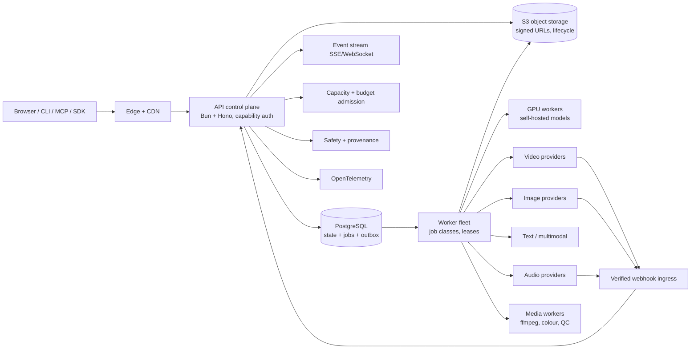

# Hollywood Video — Full Scope (AAA Studio Edition)

**Version:** 1.0
**Date:** 2026-09-05
**Status:** Approved scope; end-to-end execution authorized 2026-09-05 (see PROGRAM-EXECUTION.md)
**Owner:** Marlandoj / Alaric (Chief of Staff)
**Linear project:** Hollywood Video (`b3a50d28`)
**Linear program:** ZOU-1584 `[HV-100]`; epics HV-016 to HV-040 filed as ZOU-1585 to ZOU-1609 (Backlog, children of ZOU-1584)
**Supersedes for scope purposes:** the "thin vertical slice" implementation contract in `PROJECT.md`. `PROJECT.md` remains the canonical product-principles document; this file is the canonical scope envelope.

---

## 0. Mandate and assumptions

Operator direction (2026-09-05): *"This is a hard requirement to be as feature-rich as possible. There is no budget limit and no limit to the features. Think about what this app could do with what it can already do and exceed it to a AAA movie-making app worthy of the development name, Hollywood Video."*

This document scopes the product to that mandate. Assumptions carried forward unless the operator overrides them:

| # | Assumption | Source |
|---|---|---|
| A1 | End-user access stays **free and anonymous**: no account, payment, trial, or paid tier. "No budget limit" applies to development and operator-funded capacity, not to charging users. | ADR-0018, `PROJECT.md` Access commitment |
| A2 | **Naming gate** stands. "Hollywood Video" remains the development codename until counsel clears it. Nothing here creates public branding. | `PROJECT.md` Naming gate |
| A3 | **Safety refusals** are non-negotiable and expand, never shrink: minors, identifiable real people, non-consensual intimate content, political deepfakes, trademarked brands, incitement, hate. | `packages/safety` |
| A4 | **Provider independence** remains a product feature. Every external model sits behind a versioned adapter. No feature may be implemented in a way that only one provider can satisfy. | `PROJECT.md` Product principles |
| A5 | Operator budget caps remain as **safety mechanisms**, set high rather than removed. A kill switch must always exist. | `packages/operator` CostLedger |
| A6 | Evidence governance continues: every pillar ships behind benchmarks, tests, and post-flight evals through the Zouroboros factory. | Workspace practice |

---

## 1. Baseline: what the app does today

Repository `marlandoj/hollywood-video-app`, main `1a6c3ba`, 190 tests, Bun 1.4.0. Private staging on the operator tailnet, mock generator for every stage.

**Packages:** `parser`, `planner`, `generator`, `queue`, `assembler`, `safety`, `operator`, `api`, `frontend`, `benchmarks`.

**API surface (12 routes):** create project; get project; put script; post rights attestation; post job (animatic or final); animatic decision; get job; create review link; get review; review decision; signed artifact GET; health.

**Pipeline:** Fountain text → parse scenes/paragraphs → plan shots with a per-tier budget (free tier 24 shots, largest-remainder allocation, ≥1 shot per scene) → safety gate on every prompt → animatic job (mock colour slates, one per shot) → human approval bound to the script version → final job (mock, or fal.ai Kling v2.5 / Veo 3 fast behind `FalVideoProvider`) → assemble with ffmpeg → H.264 MP4 + HLS + SRT/VTT captions from dialogue → signed artifact URLs → review link with approve/request-changes.

**Governance already built:** rights attestation gate, stale-animatic approval invalidation, per-shot cost cap, sunk-cost accounting for abandoned paid requests, failover primary→secondary, repair loop, cost ledger, operator review queue, anonymized analytics, 72 h capability links, 30 d retention sweeper, zero cookies, benchmark gate in CI (deterministic metrics 5 %, latency 35 % normalized).

**What it cannot do today:** no imagery in animatics; no characters, locations, or style bible as data; no storyboards; no voice, music, or sound; no editing after render; no continuity checks; single video modality; no collaboration beyond one review link; no image, 3D, or audio adapters; local disk instead of object storage; JSON files instead of PostgreSQL; one worker; no public API, CLI, or SDK.

The scope below keeps every existing capability and gate, and expands each into a full studio department.

---

## 2. Product definition at AAA scale

Hollywood Video becomes a **complete virtual film studio**: every department of a physical studio exists as software, staffed by AI crew agents, governed by human approval gates, funded by the operator, and free to the filmmaker.

The organizing model is **twelve departments plus studio operations**:

| Department | Real-studio analogue | Owns |
|---|---|---|
| Development | Story department | Loglines, treatments, outlines, script drafts, coverage |
| Writers' Room | Screenwriters | Fountain editor, revisions, branches, locked lines, dialogue polish |
| Pre-production | Producers, 1st AD | Breakdown, scheduling of renders, budgets (internal), call sheets |
| Casting | Casting director | Digital actors, identity locks, voice casting, consent |
| Art | Production designer | Locations, props, wardrobe, style bible, concept art |
| Camera | DP | Shot lists, lenses, camera moves, lighting, blocking, keyframes |
| Production | Unit production | Generation engine, render farm, provider routing, continuity supervisor |
| Editorial | Editor | NLE timeline, variants, assembly, pacing, titles |
| Sound | Sound department | Dialogue, ADR, Foley, ambience, score, mix, stems |
| VFX | VFX house | Compositing, roto, mattes, effects, motion graphics |
| Post & Color | Colorist, finishing | Grade, LUT, HDR, conform, QC |
| Distribution | Distributor | Masters, deliverables, subtitles, accessibility, festival packages |
| Studio Operations | Studio management | Capacity, fair queues, safety, provenance, rights, observability, platform SDK |

Every department exposes: **data** (structured, versioned, exportable), **tools** (deterministic operations), **agents** (AI crew that propose), and **gates** (humans that approve).

---

## 3. Feature pillars

Each pillar lists: **Today**, **Full scope**, and the **Exceed** leap that pushes beyond what commercial tools do.

### P1 — Development and Writers' Room

**Today:** paste Fountain, parse scenes and dialogue, one revision, approval bound to version hash.

**Full scope:**
- Fountain-native editor with live preview, scene headings, action, character, dialogue, parentheticals, transitions, dual dialogue, notes, boneyard, sections and synopses.
- Import: Fountain, plain text, Final Draft FDX, PDF (OCR + structure recovery), Celtx, Highland, Markdown outline. Export: Fountain, FDX, PDF (industry format), JSON.
- Development ladder: logline → treatment → beat sheet (Save the Cat, Hero's Journey, three-act, kishōtenketsu, user-defined) → outline → scene drafts → full script, with each rung linked and diffable.
- Revisions: immutable snapshots, named branches, revision colours (white through goldenrod), side-by-side diff, restore points, merge with conflict view.
- Locked lines and protected sections that no agent may alter.
- Script reports: runtime estimate by genre pacing, speaking-time per character, cast/location/prop breakdown, scene day/night, page-per-scene, dialogue density, Bechdel and representation reports, readability.
- Table read: temporary voices read the script aloud with per-character casting; export as audio.
- Coverage generator: professional-format coverage (logline, synopsis, strengths, weaknesses, pass/consider/recommend) from a Script Doctor agent.

**Exceed — The Living Screenplay:** the script and the film are one bi-directional document. Editing a line of dialogue after render re-plans only the affected shot, re-renders it, re-cuts it into the timeline, and re-captions it, with an impact preview before commit. Conversely, trimming a shot in the timeline offers to update the script. No other tool makes the screenplay the live control surface of a rendered film.

### P2 — Casting and Digital Actors

**Today:** none. Characters are strings in dialogue.

**Full scope:**
- Character records: appearance, age range, ethnicity, body, wardrobe per scene, hair/makeup, expressions, movement vocabulary, relationships, arc notes, prohibited changes, consent status.
- Character sheet generation: turnaround (front/side/back/three-quarter), expression sheet, wardrobe sheet, lighting sheet, age variants, using locked seed and identity embeddings.
- Identity lock: per-character identity representation (reference set + embedding + optional per-project fine-tune) that every downstream render is conditioned on.
- Voice casting: audition multiple synthetic voices per character, direct with tone/pace/accent/age, lock the cast voice. Real-person voice cloning only with recorded consent and never for identifiable public figures.
- Digital Actor Contract: a signed, versioned record of what an actor identity may be used for (project, scenes, rating, territories, term), enforced at render admission.
- Cast library: reuse actors across projects with project-level isolation by default and explicit sharing.
- Background and extras: crowd generation with non-identifiable faces; automatic likeness checks against public-figure detectors.

**Exceed — Persistent Digital Actors:** an actor is a durable, portable asset with continuity memory: what they wore in scene 12, the scar from scene 4, the haircut change in act 3. The continuity supervisor reads this memory at every render.

### P3 — Art Department and Style Bible

**Today:** none.

**Full scope:**
- Location records: layout, geography, time-of-day states, weather states, lighting plan, palette, persistent props, reference boards, establishing-shot library.
- Prop and vehicle records with scale, condition states, ownership, and scene continuity.
- Style bible: medium (live-action, animation styles, stop-motion, noir, anime, painterly, documentary), period, palette, texture, aspect ratio, frame rate, lens language, camera-movement rules, lighting rules, editing rhythm, audio style, typography.
- Concept art generation: mood boards, key art, location boards, prop sheets, all with provenance and licence records.
- Style transfer and style lock: a style embedding derived from approved concept art and applied to every render.
- Set continuity: location state machine (before/after the fire, day 1 vs day 3) applied to shots automatically.

**Exceed — World Bible:** a location, prop, and style graph shared across multiple films (a "universe"), so a sequel inherits the world and its continuity memory.

### P4 — Camera Department and Direction

**Today:** planner derives one shot per paragraph with a generic prompt.

**Full scope:**
- Shot list generator: shot size, angle, height, lens (focal length, anamorphic/spherical), movement (static, pan, tilt, dolly, crane, handheld, Steadicam, drone), speed, duration, blocking, eyelines, screen direction, performance direction, sound intent, transition intent.
- Director's viewfinder: interactive framing tool on a storyboard or 3D previs with lens simulation.
- Lighting plan per shot: key/fill/back, motivated sources, colour temperature, contrast ratio, time-of-day.
- Coverage checker: master, singles, over-the-shoulders, inserts, reaction shots, establishing, cutaways; 180-degree rule and eyeline checks; missing-coverage warnings before render.
- Keyframe control: first frame, last frame, mid-frame anchors, camera path curves, subject path curves, for providers that support them; automatic fallback strategies for those that do not.
- Shot variants: A/B/C takes with different lenses or moves, rendered as a group and compared in a synchronized viewer.
- Camera and lens presets: real-world camera/lens packages (documentary 16mm look, anamorphic 2.39, IMAX-style) as style constraints.

**Exceed — Auto-coverage with Director Loop:** the app proposes complete coverage per scene, the director accepts, edits, or gives notes in plain language ("tighter on her, slower push-in"), and the shot list regenerates only the affected shots. Notes are stored as directable intent, replayable on re-render.

### P5 — Generation Engine

**Today:** mock and fal.ai (Kling, Veo) video only; one provider chain; per-shot cost cap; failover; repair loop.

**Full scope:**
- Modalities: text/multimodal, image, video (text-to-video, image-to-video, reference-to-video, video-to-video), audio (voice, music, SFX, ambience), 3D (assets and scenes), upscaling, frame interpolation, extension, inpainting/outpainting, relighting, depth and segmentation.
- Capability registry: every adapter publishes a capability snapshot (inputs, reference limits, durations, aspect ratios, resolutions, audio, frame controls, extension, cancellation, price version, policy version, region, health). The router matches shot requirements to capabilities; no hard-coded model names in product code.
- Quality presets: draft, preview, standard, hero, and archival, each mapped to provider tiers and post-processing chains.
- Hero-render chain: base render → upscale to 4K → interpolate to target fps → denoise → colour-managed output, with per-stage provenance.
- Multi-provider routing on capability, price, latency, policy, health, and evaluation scores, with canaries and circuit breakers.
- Self-hosted model lane: open-weight video/image/audio models on operator GPUs (Modal or dedicated fleet) behind the same adapter contract, for cost, privacy, and provider independence.
- Deterministic mode: seeds, fixed model versions, and manifests so a film can be re-rendered bit-comparably where the provider allows.
- Batch and priority: hero shots render at high quality; B-roll at standard; animatic at free.

**Exceed — Reproducible Film Manifest:** every export ships a manifest (script hash, bible hashes, shot specs, provider/model versions, seeds, post chains). Anyone with the manifest and provider access can regenerate the film or any shot, and the app can re-render a whole film on a new provider generation with a diff report.

### P6 — Continuity Supervisor

**Today:** none.

**Full scope:**
- Continuity packet per render: characters present (identity locks, wardrobe state, injuries), location state, time, weather, lighting, screen direction, eyelines, props in hand, last approved frame.
- Drift detection: face/subject similarity to locks, wardrobe and palette match, location match, composition and screen-direction checks, OCR for accidental text, logo detection.
- Repair loop: one-click corrected re-render spec (stronger reference weight, seed change, provider change, inpaint region).
- Continuity fact extraction from approved frames with confirmation before canonization.
- Continuity report per scene and per film; human rubric review with blinded scoring.
- Last-frame handoff: carry the approved last frame into the next shot's first-frame constraint when supported.

**Exceed — Calibrated Continuity Score:** a scored, benchmarked continuity metric calibrated against human rubrics on the studio corpus; used as advisory in review, and as a gate for auto-approval only after calibration evidence.

### P7 — Performance, Dialogue, and Lip-sync

**Today:** captions from dialogue; silent audio.

**Full scope:**
- Dialogue synthesis per character from the cast voice with emotion, pace, emphasis, pauses, and pronunciation dictionary.
- Line-by-line direction and retakes; alternate reads; ADR workflow to replace lines after picture lock.
- Lip-sync: audio-driven mouth animation on rendered shots via lip-sync adapters, with quality scoring and fallback to cutaway suggestions.
- Performance direction: emotion, intensity, gesture vocabulary passed to video providers that support it.
- Multi-language dubbing with per-language review, lip-sync re-timing, and dubbed caption tracks.
- Narration and voice-over tracks with ducking.

**Exceed — Directed Performance Memory:** performance notes ("she is exhausted here") persist per character per scene and inform video, voice, and lip-sync consistently across re-renders.

### P8 — Editorial

**Today:** deterministic concatenation in script order; no editing.

**Full scope:**
- Multi-track NLE timeline: video, dialogue, ambience, music, SFX, captions, overlays, adjustment layers.
- Operations: ripple/roll/slip/slide, split, reorder, duplicate, replace, freeze frame, speed ramps, crop/reframe, opacity, volume, fades, crossfades, L/J cuts, markers.
- Variants: every shot holds takes; swap takes in place; synchronized A/B and split-screen compare.
- Proxy workflow: instant proxies for responsive editing, deterministic full-resolution conform on export.
- Editor agent: proposes cuts for pacing, rhythm, and genre conventions; produces alternate assemblies (director's cut, trailer cut, 60-second cut); explains each decision.
- Titles, lower thirds, credits, slates, watermark controls (off by default for users; on for review links if chosen).
- Interchange: OTIO, EDL, FCPXML, AAF, and Resolve/Premiere-compatible exports with media, so a filmmaker can finish in professional tools.
- Append-only edit-operation log with undo/redo and version branches of the cut.

**Exceed — Cut from the Script:** the timeline and the script scroll in lockstep. Selecting a line highlights the frames; dragging a scene reorders the cut and offers to reorder the script.

### P9 — Sound Department

**Today:** silent AAC track.

**Full scope:**
- Score: model-generated music from mood, tempo, instrumentation, and cue sheet; themes per character or location; stingers; adaptive length to picture; only where licence terms permit distribution.
- Foley and SFX: text-described effects with duration and loop control; auto-spotting from action lines ("door slams").
- Ambience beds per location and time-of-day.
- Mix: dialogue ducking, stem-aware mixing, loudness normalization (EBU R128, ATSC A/85), limiter, noise reduction, meters.
- Stems: dialogue, music, effects, ambience, and M&E exports.
- Cue sheets for licensing.

**Exceed — Auto-spotted Sound Design:** a sound-design agent reads the script and picture, spots every cue, builds the session, and presents it for approval as a spotting list the user can edit.

### P10 — VFX and Motion Graphics

**Today:** none.

**Full scope:**
- Compositing: layers, masks, roto, mattes, keying (green screen), sky replacement, relighting, depth-based effects, particles, lens effects, stabilisation.
- Motion graphics: titles, kinetic typography, lower thirds, maps, data callouts, end-credit rolls, produced through the HyperFrames pipeline already in the workspace.
- Generated inserts: screens, signage, documents, newspapers, and UI props with trademark-safe content.
- Shot extension and re-timing for VFX needs.

**Exceed — Effect from Description:** an action line such as "the window shatters inward" produces a shot-specific VFX plan (matte, particle pass, sound cue) executed across departments.

### P11 — Color and Finishing

**Today:** none.

**Full scope:**
- Colour-managed pipeline (ACES) with input transforms per provider, working space, and output transforms per deliverable.
- Grading: primaries, curves, secondaries, LUT import/export, shot matching across a scene, look presets from the style bible, film-emulation looks.
- HDR (PQ/HLG) masters where source quality allows; SDR derivations.
- QC: black/freeze/corruption detection, illegal levels, aspect and safe-area checks, caption overflow, audio channel checks, decodability across players.

**Exceed — Look Lock:** the colourist agent derives a look from approved concept art and applies it to every shot at render and finish, so the film is graded before the first cut.

### P12 — Delivery and Distribution

**Today:** 720p/1080p H.264 MP4, HLS, SRT/VTT; 30-day artifacts.

**Full scope:**
- Masters: ProRes/DNx mezzanine, H.264/H.265/AV1, WebM, 4K and 8K where source allows, HDR and SDR.
- Deliverables: 16:9, 9:16, 1:1, 4:5, 2.39:1 with shot-aware reframing; social cut-downs; trailers; stills; poster frames; thumbnails.
- Packages: DCP (SMPTE), IMF, festival submission bundles, broadcast spec bundles, streaming ladders.
- Subtitles and captions: SRT, VTT, TTML/IMSC, burned-in, styled, multi-language; SDH; audio description track.
- Archive: portable project archive (documented schema, content hashes, manifest, all sources), restore on any instance.
- Publishing adapters (opt-in, post security review): YouTube, Vimeo, and file-transfer targets, never with stored social credentials by default.

**Exceed — One-click Festival Package:** DCP, trailer, stills, synopsis, credits, subtitles, and tech spec sheet generated from project data.

### P13 — Collaboration and Studio Management

**Today:** one review link with approve/request-changes.

**Full scope:**
- Capability-link roles: owner, producer, director, writer, editor, sound, colourist, reviewer, with scoped permissions, expiry, and revocation. No accounts.
- Review rooms: frame-accurate comments on script lines, shots, frames, and timecodes; drawing annotations; version compare; approval states per stage (script, bible, boards, shots, cut, mix, master).
- Presence and activity: who is viewing what, immutable audit events, mentions, handoffs, notifications by email/SMS/webhook (opt-in).
- Production management: internal schedule of renders, dependency view, render budget view (operator-only), call-sheet-style daily summaries.
- Templates: genre and format templates; controlled project duplication without asset leaks.

**Exceed — Studio Rooms:** a persistent, accountless shared studio where multiple films share cast, world, and style, with per-film isolation by default.

### P14 — Provenance, Rights, and Safety

**Today:** rights attestation, safety gate on prompts, seven refusal categories, anonymised analytics.

**Full scope:**
- Provenance: C2PA content credentials on every export and intermediate asset; signed manifests; provider and model versions; seeds.
- Rights ledger: source, licence, term, territory, media, attribution for every uploaded and generated asset; consent records for voice and likeness; revocation stops future generation without falsifying history.
- Moderation: text, reference imagery, generated frames, final composites, and audio; public-figure detection; minor detection; trademark and logo detection; appeals path; takedown workflow; legal hold.
- Watermark policy: no watermark for users; visible watermark optional on review links; invisible provenance always on.
- Abuse controls: privacy-preserving rate limits, risk challenges with accessibility fallbacks, fair-queue penalties, rapid revocation.

**Exceed — Auditable Film:** any frame of any export can be traced back to its shot spec, prompt, references, model version, seed, and the approvals that admitted it.

### P15 — Capacity, Economics, and Operations

**Today:** JSON cost ledger, per-shot cap, monthly budget, one worker, local disk.

**Full scope:**
- Fair queues at network, session, project, and job levels; public queue status; graceful reduced-capacity modes; editing and export always available even when generation pauses.
- Operator console: budgets, provider health, queue depth, failure rates, latency, cost variance, deprecation controls, kill switches per provider and global.
- Render farm: horizontally scaled worker fleet; GPU workers for self-hosted models; job classes with leases, retries, idempotency, dead-letter; webhook and polling reconciliation.
- Storage: S3-compatible object storage with multipart upload, lifecycle policies, signed short-lived URLs, CDN delivery, regional placement.
- Data: PostgreSQL as system of record and job coordinator; Drizzle migrations; row-level capability checks.
- Observability: OpenTelemetry traces from session action to provider attempt to export; metrics; structured logs; cost dashboards.
- Reliability: 99.9 % control-plane target, RPO 5 min for state, near-zero loss for approved media, multi-region option, disaster-recovery drills.

**Exceed — Capacity Transparency:** a public, privacy-preserving capacity page showing queue state, subsidy remaining, and fairness rules, so free access is trustworthy rather than mysterious.

### P16 — Platform, SDK, and Extensibility

**Today:** none.

**Full scope:**
- Public REST API with capability tokens; OpenAPI spec; SDKs (TypeScript, Python).
- CLI: script → film from the terminal; batch operations; archive import/export.
- MCP server: every studio operation exposed as tools so external agents can direct a film.
- Webhooks for job and approval events.
- Adapter SDK: third parties add providers behind the versioned contract with conformance tests.
- Plugin points: import/export formats, QC checks, agents.
- Self-host distribution: single-command deploy with bundled open-weight models; documented archive schema for portability.

**Exceed — Studio as a Protocol:** the project archive and manifest schema are published, so films are portable across any Hollywood Video instance, including self-hosted ones.

### P17 — AI Crew (Agents)

**Today:** none; deterministic planner.

**Full scope:** a crew of bounded, gated agents, each with a defined mandate, inputs, outputs, and approval gate. None can spend operator budget without admission.

| Agent | Mandate |
|---|---|
| Script Doctor | Coverage, notes, dialogue alternatives, tone shifts, feasibility |
| Assistant Director | Breakdown, shot list, coverage, schedule of renders |
| Casting Director | Character sheets, voice auditions, identity locks |
| Production Designer | Locations, props, style bible, concept art |
| Cinematographer | Lenses, moves, lighting plans, keyframes |
| Continuity Supervisor | Packets, drift detection, repair specs |
| Editor | Assemblies, pacing, alternate cuts, explanations |
| Sound Designer | Spotting, Foley, ambience, mix proposals |
| Composer | Themes, cues, adaptive score |
| Colourist | Looks, matching, finish |
| VFX Supervisor | Effect plans, composite passes |
| Critic | Blind review against rubric; flags weaknesses before render spend |

**Exceed — The Director Loop:** the filmmaker gives notes in plain language at any stage; the relevant agents propose changes with an impact set; nothing executes until approved. The loop is replayable, so a film's entire creative history is a sequence of notes and approvals.

### P18 — Previs, Virtual Production, and Immersive

**Today:** none.

**Full scope:**
- 3D previs: generated 3D sets and character proxies; virtual camera with real lens simulation; blocking on a floor plan; exported camera paths as keyframe constraints for video providers.
- Virtual production export: scenes, cameras, and assets to Unreal/Unity/Blender formats for teams that finish in engines.
- Immersive formats: VR180, 360, and vertical-first series formats.
- Interactive narratives: branching scripts, choice points, and exports as interactive web players.

**Exceed — Previs-to-Final Continuity:** the 3D previs camera and blocking become hard constraints on the generated shot, closing the gap between planned and rendered coverage.

---

## 4. The ten leaps that define "AAA"

1. **Living Screenplay** — script and film are one bi-directional document.
2. **Persistent Digital Actors** with continuity memory and contracts.
3. **World Bible and Universes** shared across films.
4. **Director Loop** — plain-language notes drive every department, gated, replayable.
5. **Reproducible Film Manifest** — regenerate any shot or the whole film on any provider.
6. **Calibrated Continuity Score** — measured, benchmarked, advisory then gating.
7. **Cut from the Script** — timeline and screenplay in lockstep.
8. **One-click Festival Package** — DCP, trailer, stills, subtitles, spec sheet.
9. **Auditable Film** — C2PA provenance on every frame back to approvals.
10. **Studio as a Protocol** — public API, MCP, CLI, portable archives, self-host.

---

## 5. Architecture at scale

**Migration from baseline:** JSON state → PostgreSQL (Drizzle); local artifacts → S3-compatible storage with a compatibility shim; single worker → job classes on a fleet; mTLS edge retained; tailnet staging retained until launch gates pass.

**Service decomposition (only when evidence justifies):** control plane, worker plane (generation, media, QC), GPU plane, edge. Redis only for realtime fan-out at measured scale.

---

## 6. Data model expansion

Baseline entities retained. Additions:

| Domain | Entities |
|---|---|
| Story | `treatment`, `beat_sheet`, `outline`, `script_branch`, `locked_span`, `coverage_report` |
| Cast | `actor_identity`, `identity_lock`, `voice_cast`, `actor_contract`, `consent_record` |
| Art | `location_state`, `prop_state`, `style_bible`, `look`, `concept_asset`, `universe` |
| Camera | `shot_spec_v2` (size, angle, lens, move, lighting, blocking, keyframes), `coverage_check`, `director_note` |
| Production | `capability_snapshot`, `route_decision`, `render_variant`, `post_chain`, `film_manifest` |
| Continuity | `continuity_packet`, `drift_finding`, `repair_spec`, `continuity_score` |
| Performance | `dialogue_take`, `lipsync_pass`, `performance_note`, `dub_track` |
| Editorial | `timeline_v2`, `track`, `clip`, `edit_operation`, `cut_version`, `interchange_export` |
| Sound | `cue`, `spotting_list`, `stem`, `mix_revision`, `loudness_report` |
| VFX | `composite`, `matte`, `effect_plan`, `motion_graphic` |
| Colour | `grade`, `lut`, `look_lock`, `qc_report` |
| Delivery | `deliverable`, `package` (DCP/IMF/festival), `subtitle_track`, `archive` |
| Collaboration | `role_grant_v2`, `review_room`, `annotation`, `approval_v2`, `notification` |
| Governance | `provenance_manifest` (C2PA), `rights_record`, `policy_decision`, `takedown`, `legal_hold` |
| Operations | `capacity_grant`, `queue_position`, `provider_health`, `cost_event`, `budget_envelope` |
| Platform | `api_token`, `webhook_subscription`, `adapter_registration`, `plugin` |

All mutable entities: stable IDs, optimistic concurrency, revision numbers, soft delete. Usage, cost, provenance, audit: append-only.

---

## 7. Provider candidate matrix

Selection stays in evaluation records and ADRs, never in product code. This matrix lists candidates to evaluate per modality; each must pass the adapter conformance suite and the studio benchmark before promotion.

| Modality | Candidates to evaluate | Notes |
|---|---|---|
| Video | Kling (live), Veo (live), Runway, Luma, Wan, Hunyuan, Seedance, Sora-class, Minimax | Two promoted providers minimum; one self-hosted open-weight lane |
| Image | FLUX family, Imagen, gpt-image-2, nano-banana, SDXL-class self-hosted | Text rendering, identity conditioning, style lock support |
| Identity | IP-Adapter, InstantID, per-project LoRA, provider-native reference | Feeds identity locks |
| Voice | ElevenLabs, OpenAI TTS, Google, self-hosted (XTTS, Kokoro) | Consent-gated cloning |
| Lip-sync | LatentSync, MuseTalk, Wav2Lip-class, provider-native | Quality scoring required |
| Music | Suno/Udio-class, Stable Audio, MusicGen self-hosted | Licence terms decide distribution eligibility |
| SFX/ambience | ElevenLabs SFX, AudioGen, Stable Audio | Auto-spotting |
| Upscale/interpolate | Real-ESRGAN, Topaz-class, RIFE, FILM | Hero-render chain |
| 3D | Hunyuan3D, Trellis, provider APIs | Previs |
| Text/multimodal | Claude, GPT, Gemini, Kimi, GLM via existing BYOK lineups | Agents; routed through Zouroboros model policy |
| Segmentation/depth | SAM-class, Depth Anything | VFX and continuity |
| Provenance | C2PA SDK | All exports |

---

## 8. Quality system at scale

- **Studio corpus:** expand the frozen 24-shot benchmark to a 240-shot corpus across genres, styles, and formats, with recurring characters, dialogue, action, night, weather, crowds, and VFX cases.
- **Blinded human rubrics** for continuity, performance, pacing, sound, and finish; calibration of every automated score against them.
- **Automated metrics:** identity similarity, palette match, composition, caption alignment (p95 ≤ 250 ms), loudness compliance, QC pass rate, provider success rate, cost variance (≤ 5 % or $0.05), determinism where supported.
- **Gates in CI:** deterministic metrics 5 %, latency 35 % normalized (existing), plus per-pillar regression suites and adapter conformance.
- **Public leaderboard:** anonymised, reproducible provider comparisons published from the benchmark, a trust and distribution asset.
- **Chaos:** timeouts, 429s, 5xx, duplicate webhooks, stale prices, worker death, partial media, provider deprecation, storage failure.
- **Security:** capability isolation, signed URL scope, IDOR, SSRF, upload bombs, webhook forgery, prompt injection through scripts and references, model-output policy evasion.

---

## 9. Delivery program

Waves are ordered by dependency, not by calendar. With no budget ceiling, waves run in parallel through the Zouroboros factory wherever migrations, shared primitives, and adapter contracts do not conflict. Each epic defines acceptance tests, rollback, observability, and cost impact before dispatch.

| Wave | Epics | Exit |
|---|---|---|
| **A — Foundation at scale** | HV-040 Storage & archive, HV-038 Observability & reliability, HV-032 Capacity & render farm (part 1: PostgreSQL, S3, worker fleet) | Staging runs on PostgreSQL + S3 with the existing E2E passing; fleet of ≥3 workers |
| **B — See the film** | HV-018 Storyboard & rich animatic, HV-017 Character identity engine, HV-019 Generation router & capability registry, HV-020 Cinematography control | Animatic shows real storyboard frames with temp voice; identity locks hold across 8 shots on the corpus |
| **C — Hear the film** | HV-022 Performance & lip-sync, HV-024 Sound department, HV-028 Localization & dubbing (part 1) | Dialogue, ambience, and score on the Spud film; loudness-compliant mix |
| **D — Shape the film** | HV-023 Editorial NLE, HV-016 Writers' room & living screenplay, HV-021 Continuity supervisor, HV-026 Color & finishing | Edit-after-render, script-linked timeline, calibrated continuity report |
| **E — Finish the film** | HV-025 VFX & titles, HV-027 Delivery suite, HV-031 Provenance & rights (C2PA), HV-039 Accessibility & mobile review | Festival package export with C2PA on every asset |
| **F — Run the studio** | HV-029 Collaboration studio, HV-030 AI crew & director loop, HV-034 Universe & library, HV-037 Studio benchmark & leaderboard | Multi-role review rooms; director loop replay; 240-shot benchmark public |
| **G — Open the studio** | HV-033 Platform SDK (API, CLI, MCP, webhooks, adapter SDK), HV-032 part 2 (GPU fleet, self-hosted lane), HV-035 Previs & virtual production, HV-036 Interactive & immersive | External agent directs a film via MCP; self-hosted deploy produces identical manifest output |
| **H — Launch** | HV-013/014/015 (existing) | Name cleared, legal terms, security audit, operator approval; public free access |

Existing epics HV-001 through HV-015 remain and absorb their baseline scope; the new epics HV-016 through HV-040 extend them.

### Epic register (new)

| ID | Epic | Pillar | Depends on |
|---|---|---|---|
| HV-016 | Writers' Room and Living Screenplay | P1 | HV-003, HV-023 |
| HV-017 | Character Identity Engine and Digital Actors | P2 | HV-004, HV-019 |
| HV-018 | Storyboard and Rich Animatic (stills, temp voice, camera moves) | P3/P4 | HV-005, HV-019 |
| HV-019 | Multi-provider Generation Router and Capability Registry | P5 | HV-006 |
| HV-020 | Cinematography Control (lens, move, lighting, blocking, keyframes) | P4 | HV-005, HV-019 |
| HV-021 | Continuity Supervisor (packets, drift, repair, calibrated score) | P6 | HV-017, HV-008 |
| HV-022 | Performance: Voice Casting, Dialogue, Lip-sync, ADR | P7 | HV-017, HV-019 |
| HV-023 | Editorial NLE (timeline, variants, proxy, interchange) | P8 | HV-009 |
| HV-024 | Sound Department (score, Foley, ambience, mix, stems) | P9 | HV-010, HV-023 |
| HV-025 | VFX and Motion Graphics (compositing, HyperFrames titles) | P10 | HV-023 |
| HV-026 | Color and Finishing (ACES, grade, HDR, QC) | P11 | HV-023 |
| HV-027 | Delivery Suite (masters, DCP/IMF, ladders, cut-downs, subtitles) | P12 | HV-011, HV-026 |
| HV-028 | Localization and Dubbing | P7/P12 | HV-022 |
| HV-029 | Collaboration Studio (roles, review rooms, approvals, notifications) | P13 | HV-012 |
| HV-030 | AI Crew Agents and Director Loop | P17 | HV-016, HV-020, HV-023 |
| HV-031 | Provenance and Rights (C2PA, rights ledger, takedown, legal hold) | P14 | HV-004, HV-014 |
| HV-032 | Capacity and Render Farm (fleet, GPU lane, self-hosted models, CDN) | P15 | HV-007, HV-040 |
| HV-033 | Platform SDK (API, CLI, MCP, webhooks, adapter SDK, self-host) | P16 | HV-032 |
| HV-034 | Universe and Library (shared cast, world, style across films) | P2/P3 | HV-017 |
| HV-035 | 3D Previs and Virtual Production Export | P18 | HV-020 |
| HV-036 | Interactive and Immersive Formats | P18 | HV-027 |
| HV-037 | Studio Benchmark and Public Leaderboard (240-shot corpus) | §8 | HV-001, HV-019 |
| HV-038 | Observability, Reliability, Multi-region | P15 | HV-002 |
| HV-039 | Accessibility (WCAG 2.2 AA) and Mobile Review | UX | HV-029 |
| HV-040 | Storage and Archive at Scale (PostgreSQL, S3, lifecycle, portable archive) | P15 | HV-002 |

---

## 10. Non-negotiables retained

- Free and anonymous for every end user; no billing code reachable.
- Naming gate before any public identity.
- Safety refusals expand only.
- Provider independence and versioned adapters.
- Human approval gates before operator spend at every stage.
- Provenance on every output.
- Evidence before promotion: tests, benchmarks, post-flight evals, gap audits.

---

## 11. Principal risks at this scale

| Risk | Mitigation |
|---|---|
| Scope sprawl delays anything usable | Wave exits are user-visible films, not feature inventories; Wave B ships the visible animatic first |
| Provider churn | Capability registry, two promoted providers per modality, self-hosted lane, conformance suite |
| Runaway operator spend with caps set high | Kill switches, per-shot and per-project envelopes, hero renders gated by approval, daily burn dashboard |
| Identity and likeness abuse grows with capability | Consent-gated cloning, public-figure and minor detectors on references and outputs, contracts enforced at admission |
| Music and voice licensing | Licence terms recorded per provider; distribution eligibility computed per export |
| Continuity promises exceed model ability | Score is advisory until calibrated; repair loop and human review remain primary |
| Data migration from JSON/local disk | Dual-write shim, verified backfill, E2E parity before cutover |
| Factory lane contention across 25 epics | Wave dependency graph; migrations and shared primitives serialized; adapters parallel |

---

## 12. Decisions requested from the operator

1. **Approve this scope envelope** as the canonical program for Hollywood Video. The 25 new epics are filed in Linear as Backlog under ZOU-1584. Approval moves the program and Wave A/B epics to Todo and triggers Wave A/B seed drafting for factory intake.
2. **Confirm A1** (end users stay free and anonymous) or state otherwise.
3. **Set the operator provider envelope** for Wave B evaluations (image, identity, voice adapters need live calls to evaluate). A default of $500 for the first evaluation round is proposed.
4. **Confirm the first visible milestone**: HV-018 rich animatic (storyboard stills + temp voice + Ken Burns motion) as the first shipped wave-B feature, since it directly answers the colour-slate animatic.

---

## Appendix A — Immediate next build: HV-018 Rich Animatic

Scope: replace colour slates with generated storyboard frames.

- Image adapter contract (`ImageProvider`) mirroring `ProviderAdapter`: generate, estimate, cancel, normalize, capabilities; mock implementation renders a labelled slate with shot text (still free, still deterministic).
- One live image adapter behind fal.ai (already integrated for video), routed by `HV_ANIMATIC_PROVIDER=image:<model>`.
- Per-shot frame → Ken Burns or provider camera move → clip of shot duration; temp voice for dialogue lines when narration is enabled; captions burned optionally.
- Identity conditioning hook (empty until HV-017) so the same frame generator later honours identity locks.
- Cost: image calls charged to the ledger under the animatic stage with its own cap; animatic remains far cheaper than final.
- Tests: adapter conformance, deterministic mock frames, E2E through staging with the Spud script; benchmark gate extended with an animatic frame-count and cost check.
- Acceptance: the approval screen shows recognisable storyboard imagery per shot; approval binding to script version unchanged; $0 path still works with the mock.
